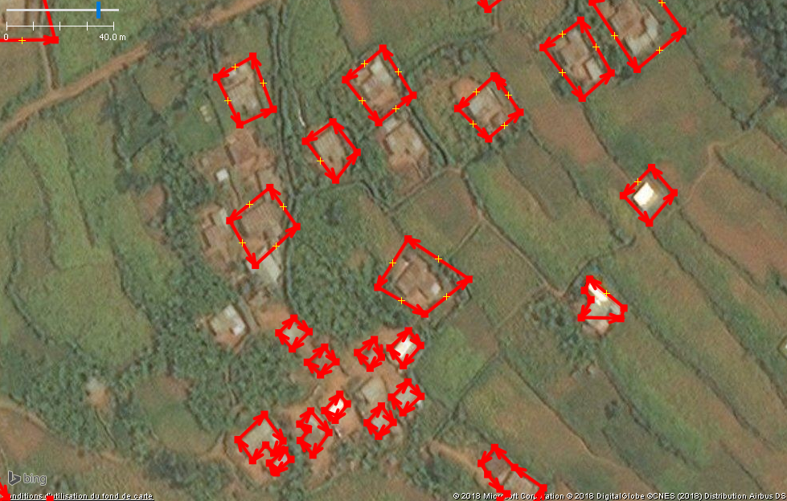

# BROUILLON
# 2018-09-02 Analyse Qualité, Base OSM: Le Gestionnaire de Tâches

 Dans [l'article précédent sur ce Blog](Analyse_Qualité_Base_OSM_Superpositions_et_Bâtiments_avec_Géométrie_irrégulière.md), le 27 août, 
 on retrouvait une comparaison de la cartographie de différentes villes (échantillon à partir des villes qui commencent leur participation 
 à Open Cities).  

Nous poursuivons la comparaison avec cette fois-ci un échantillon de la carte OSM le 30 août  couvrant la zone géographique correpondant à 
 15 tâches cartographiques OSM réalisées au cours des dernières semaines. 
 

## «State of the Map» Comparaison, Zones cartographiées récemment à l'aide du Gestionnaire de tâches

Les deux mêmes indicateurs que dans l'article précédent sont utilisés pour la comparaison selon les différentes Tâches. Les signalements sont regroupés selon
- Avertissement : Immeubles avec Géométrie irrégulière et polygones non valides
- Erreur : Superposition d'immeubles (avec autres immeubles ou autres objets)

Tout comme pour le premier échantillon comparatif, on observe une grande variabilité des résultats selon les Tâches. L'étape de validation de la cartographie via le Gestionnaire de tâches ne semble pas avoir d'impact significatif pour les tâches de cet échantillon. D'autres facteurs nous apparaissent plus déterminants.

*Graphique 1 - Observation de bâtiments avec formes irrégulières, Dar Es Salaam*

Dans les centres-ville, d'abord, le nombre de bâtiments avec des formes complexes correpond à ce qui est observé sur l'imagerie aérienne et il est donc normal d'y obsrver des taux de formes comples plus élevés que dans d'autres zones géographiques. Au Centre-ville de Dar Es Salaam et d'autres villes de Tanzanie, on observe ces formes irrégulières. Dans la base OSM, elles représentent de 10% jusqu'à 20% selon les tâche. 

*Graphique 2 - Tracés imprécis, Kochi, Inde*

À Kochi en Inde, on retrouve aussi  des architectures plus complexes mais en nombre plus réduit. Dans ce cas-ci on retrouve aussi de nombreuses maisons individuelles qui ont été tracées avec imprécision. Cependant le nombre d'immeubles signalés avec forme irégulière ne dépasse pas les 7%.

La tâche 4975 (Ndorwa County, Ouganda) attire particulièrement notre attention avec plus de 16,600 bâtiments sur 28,000 avec des formes irrégulières (
taux de signalementde 58,6% des bâtiments),  et un taux d'erreur (immeubles superposés) de 3,5% par rapport à l'ensembles des bâtiments dans la zone couverte par cette tâche.  Cette tâche n'a pas été validée et l'analyse de la cartographie de la zone montre une qualité de la cartographie très variable.
 

De telles variations résultats suite à l'analyse Qualité des bâtiments suggèrent qu'il faut davantage de suivi pour détecter et corriger rapidement les problèmes de qualité. 
*Pierre Béland*

*Graphique 3 - Tracé très approximatif des bâtiments, Ndorwa, Ouganda*

*Tableau 1 : Analyse topologique des bâtiments, échantillon basé sur 25 tâches, Gestionnaire hotosm août 2018*
*Contributeurs classés selon le taux de signalements en % des bâtiments qui lui sont crédités*

Classe |Contributeurs | Tâches | Immeubles | Avertissement Géométrie Irreg | Erreurs Superpositions +Polygone non valide | Signalements | Taux de Signalement |
:---------|--------:|------:|----------:|-----------:|-----------:|---------:|----------:|
  0         |757     |866   |49,424     |0          |0          |0        |0 %|
 1<5%       |406     |489   |241,171    |2,875       |1,081       |3,956     |1.6 %      |
 5<10%      |216     |236   |37,738     |2,178       |519        |2,697     |7.2 %     |
10<20%      |234     |277   |28,351     |3,254       |649        |3,903     |13.8 %     |
20% +       |522     |584   |40,847     |24,504      |1,616       |26,120    |64 %    |

*Tableau 2 : Comparaison, Signalements Analyse topologique en % des bâtiments de la zone, Zones couvertes par le Gestionnaire de tâches*

|	Tâche * 	|	Bâtiments	|	Avertissement Géométrie Irreg	|	%	|	Erreurs Superpositions +Polygone non valide	|	%	|	Total Signalements % | Validation |
|	:------------------------------------------	|	--------:	|	------:	|	--------:	|	------:	|	------:	|	------:	| :------------|
|		|		|		|		|		|		|		|		|
|	4954 Muchinga province, Zambia	|	53,748	|	605	|	1.1%	|	56	|	0.1%	|	1.2%	|	Validé	|
|	4958 Beni, Nord-Kivu DRC	|	71,064	|	648	|	0.9%	|	181	|	0.3%	|	1.2%	|	Validé	|
|	4975 Ndorwa County, Uganda	|	28,393	|	16,648	|	58.6%	|	981	|	3.5%	|	62.1%	|	Non validé	|
|	4994 Kalabo, Zambia	|	4,506	|	395	|	8.8%	|	38	|	0.8%	|	9.6%	|	Not Validated	|
|	4998 Blue Nile State, Sudan	|	1,148	|	49	|	4.3%	|	55	|	4.8%	|	9.1%	|	Non validé	|
|	5009 North of Kochi, India	|	15,810	|	324	|	2.0%	|	109	|	0.7%	|	2.7%	|	Validé	|
|	5010 North of Kochi, India	|	90,816	|	6,619	|	7.3%	|	1,531	|	1.7%	|	9.0%	|	Non validé	|
|	5019 Mungala Refugee settlement, Uganda	|	1,728	|	5	|	0.3%	|	28	|	1.6%	|	1.9%	|	Non validé	|
|	4976 Dar es Salaam, Tanzania 	|	1,238	|	245	|	19.8%	|	62	|	5.0%	|	24.8%	|	Validé	|
|	4978 Magata Karutonga, Tanzania	|	2,086	|	131	|	6.3%	|	18	|	0.9%	|	7.1%	|	Validé	|
|	4991 Data Zetu, Tanzania	|	28,567	|	392	|	1.4%	|	938	|	3.3%	|	4.7%	|	Not Validé	|
|	5011 Jangwani, Tanzania 	|	2,465	|	280	|	11.4%	|	81	|	3.3%	|	14.6%	|	Validé	|
|	5016 Dar es Salaam, Tanzania 	|	1,201	|	192	|	16.0%	|	28	|	2.3%	|	18.3%	|	Validé	|
|	5021 Upanga Mashariki, Dar es Salaam, Tanzania	|	2,724	|	380	|	14.0%	|	92	|	3.4%	|	17.3%	|	Validé	|
|	5022 Mchikichini, Dar es Salaam, Tanzania	|	6,597	|	659	|	10.0%	|	372	|	5.6%	|	15.6%	|	Validé	|
|		|		|		|		|		|		|		|		|
|	Total	|	312,091	|	27,572	|	8.8%	|	4,570	|	1.5%	|	10.3%	|		|

* Tâches provenant du Gestionnaire de tâches OSM ([Instance hotosm](https://tasks.hotosm.org))
