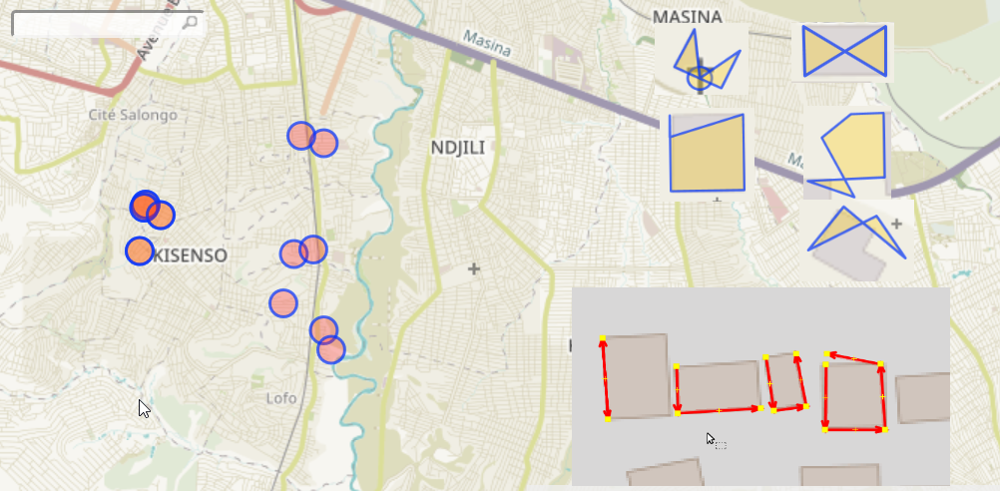
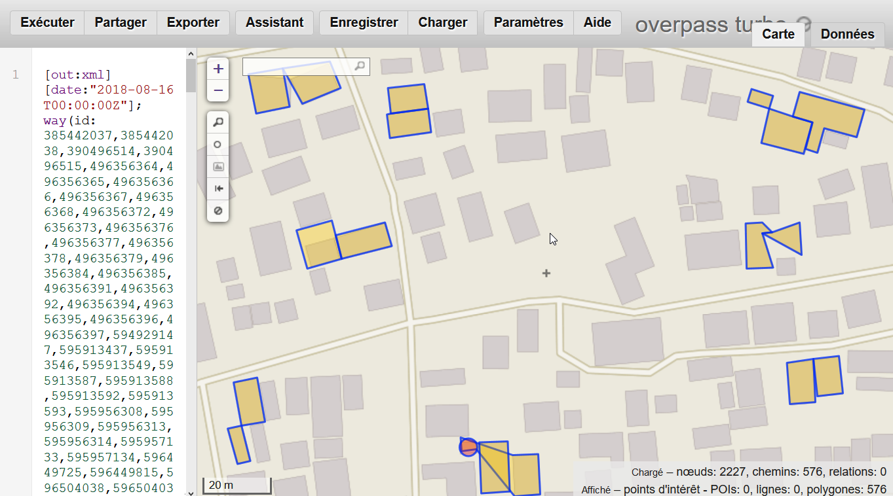
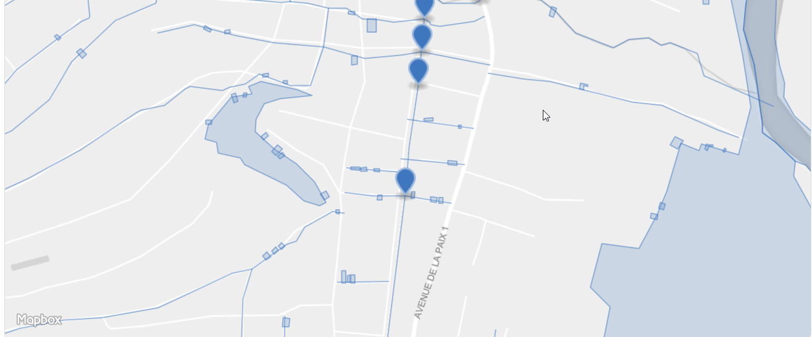
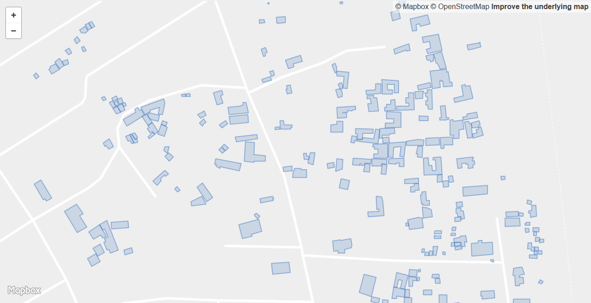

# 2018-08-26 Analyse Qualité Base OSM: Superpositions et Bâtiments avec Géométrie irrègulière - Comparaison de différents projets
*Figure 1 Polygones non valides / Outils Qualité*

Dans un [premier article](Analyse_de_la_géométrie_des_bâtiment_pour_une_meilleure_qualité_OpenStreetMap.md)
 sur ce Blog le 8 août, nous avons présenté notre classification de la forme des bâtiments. À titre d'exemple, nous avons examiné les données de bâtiments de la base OSM ajoutés pour la réponse Ebola au Nord-Kivu et mesuré la proportion de bâtiments de forme irrégulière.  Ceux-ci sont généralement en petit nombre. 

Des proportions élevées d'immeubles de forme irrégulière dans une zone sont une indication qu'il est nécessaire de valider la qualité du tracage des contours de bâtiments dans la zone.  Dans les milieux urbains denses, le défi est grand pour tracer avec précision le contour des immeubles et les allées entre ces immeubles. La situation se complique également
lorsque les images disponbiles sont sombres ou floues ou encore si différentes images ne sont pas parfaitement alignées. Les mapathons où un grand nombre de débutants participent sont aussi susceptible de causer des problèmes de qualité de la donnée OSM.

*Figure 2 Polygones non valides - Repérage* 

Dans de nombreux projets, le Gestionnaire de tâches OSM est généralement utilisé pour coordonner les contributions simultanées d'un grand nombre de participants et éviter les collisions et conflits d'édition. Ces outils assurent les gestionnaires d'un projet de cartographie de couvrir systématiquement le territoire lors des étapes de cartographie et de validation des données de la zone. Les divers outils Qualité permettent également de repérer des problèmes dans la zone et les corriger. Cependant, on constate souvent qu'après un mapathon, la donnée peut demeurer inchangée pendant des années faute de contributeurs suffisants pour parcourir la zone et corriger les données. 

L'approche que nous proposons est d'extraire les données OSM d'une zone pour une date donnée et réaliser une analyse topologique de la qualité de la donnée.  Les statistiques produites sur les objets signalés pour évaluation permettent de mesurer l'ampleur du phénomène et comparer avec d'autres projets. Cela permet également de fournir un fichier contenant les bâtiments et autres objets à valider/corriger à l'aide d'éditeurs tels JOSM. Dans ce cas, le greffon ToDO permet de réviser un à un les objets contenus dans le fichier, valider et corriger si nécessaire. L'identification des bâtiments de forme irrégulière présentait une première mesure. Les polygones de bâtiments invalides (voir figure 1) ont aussi été identifiés. 

Dans ce deuxième article sur l'analyse topologique, nous ajoutons le repérage des objets superposés (ie. bâtiments, routes, cours d'eau, polygones occupation du sol, etc) à la liste des objets signalés pour une évaluation plus poussée.

Lors de la Conférence Open Cities Africa à Dar Es Salaam cette semaine, les villes participantes discuteront notamment de la qualité de la donnée. C'est là un aspect important pour assurer la crédibilité de tels projets cartographiques bénévoles et fournir une donnée utile à différents projets nécessitant des données géographiques.   La comparaison ci-dessous de projets cartographique de différentes villes participantes et l'approche d'analyse proposées pourront, nous l'espérons, contribuer à cette discussion. 
 
 
# Analyse Qualité - Superposition des Bâtiments et autres objets

Des bâtiments, routes et autres objets tracés avec imprécision ou encore des erreurs lors de l'édition déplaçant un point auront souvent pour effet de superposer des polgyones (bâtiments, occupation du sol, cours d'eau, limites territoriales, etc) et des lignes tels routes et chemins de fer.  La figure 3 illustre ces superpositions, montrant des bâtiments et routes qui se superposent. Divers projets au cours des dernières années, souvent dans des contexte de crises ou désastres naturels ont cartographié en partie les villes faisant partie de cette liste. Malgré les validations, de nombreuses erreurs ne sont pas encore corrigées. Les outils Qualité listent ces erreurs mais il est difficile d'avoir une vue d'ensemble et de mesurer l'importance de ces signalements.

*Figure3 Immeubles et routes superposées*

Notre outil d'analyse topologique permet d'identifier chaque immeuble ou autre objet tel route, cours d'eau etc. qui superposé à un autre.  Une statistique est produite et une liste de ID OSM est aussi disponible. Une requête Overpass utilisant cette liste (voir figure 4) permet de produire des fichiers de données OSM contenant les objets concernés. Cela permet ensuite d'importer le fichier dans JOSM pour analyse et correction. Les visualisations cartographiques à partir des fichiers GeoJSON, présentés ci-dessous pour chaque ville, offrent une vue d'ensemble des objets marqués pour analyse. Il est aussi possible de se déplacer dans la carte pour examiner plus en détail.

*Figure 4 Requête Overpass - Id signalés Analyse Qualité*

# Comparaison, différentes villes du projet Open Cities Africa

Pour fin de comparaison, nous avons sélectionné des villes du projet Open Cities Africa pour lesquelles des tâches ont été réalisées à l'aide du gestionnaire de tâches OSM.  Pour la plupart, la tâche était cartographié et validé à 100%.  Chacune à son histoire, réponse rapide à un désastre ou autre, qualité d'imagerie très variable, organisation de mapathons avec des débutants, etc. L'architecture d'une ville à l'autre peut aussi varier et dans certaines villes on peut identifier un nombre plus élevé de bâtiments qui ont effectivement une forme irrégulière.  Par exemple, lors de l'épidémie d'Ebola à, Monrovia, la ville a dû être cartographiée rapidement pour aider les équipes humanitaires, et cela malgré la mauvaise qualité de l'imagerie disponible. Les images manquant encore de précision, les projets récente n'ont pas réussi à améliorer sensiblement la qualité.  À Ngaoundere, suite à un projet de cartographie récent, beaucoup de doublons et d'immeubles superposés ont été ajoutés. Cet outil d'analyse topologique perment de l'observer rapidement et apporter les corrections nécessaires.

Le tableau 1 présente une comparaison des résultats obtenus avec l'analyse topologique. Les signalements sont regroupés selon
- Immeubles - Géométrie irrégulière et polygones non valides
- Superposition d'immeubles (avec autres immeubles ou autres objets)

En moyenne, on observe un taux de signalement de 8,2% des immeubles avec géométrie irrégulière et 3.4% de superpositions  en proportion du total des immeubles. Au total, il y a 11,5% de signalements (objets à valider) en proportion des immeubles. 

*Tableau 1 : Comparaison, Signalements Analyse topologique en % des bâtiments de la zone, 6 projets Open Cities Africa*

|	Localité	|	Bâtiments	|	Géométrie	|	%	|	Superpositions	|	%	|	Total Signalements % |
|	:----------------------------------	|	----------:	|	----------:	|	------:	|	----------:	|	------:	|	----------:	|
|	Kisenso, Kinshasa 2018-08-16	|	73609	|	324	|	0.4%	|	391	|	0.5%	|	1.0%	|
|	Kampala 2018-04-07	|	11327	|	1001	|	8.8%	|	343	|	3.0%	|	11.9%	|
|	Ngaoundere 2018-08-06	|	73609	|	9998	|	13.6%	|	4439	|	6.0%	|	19.6%	|
|	Monrovia 2018-08-25	|	4107	|	750	|	18.3%	|	442	|	10.8%	|	29.0%	|
|	Accra 2018-08-25	|	4107	|	1396	|	34.0%	|	17	|	0.4%	|	34.4%	|
|	Dar Es Salaam 2018-08-25	|	2579	|	334	|	13.0%	|	80	|	3.1%	|	16.1%	|
|	Total projets analysés	|	169338	|	13803	|	8.2%	|	5712	|	3.4%	|	11.5%	|

## Kisenso, Kinshasa 2018-08-16, (polygone limites de Kisenso)
* [Kisenso, Immeubles avec géométrie irrégulière](https://github.com/opendatalabrdc/Documentation/blob/master/topology/topology-irregular-forms-kisenso-2018-08-16.geojson)
* [Kisenso, Superpositions Immeubles/Autres objets](https://github.com/opendatalabrdc/Documentation/blob/master/topology/topology-overlap-kisenso-2018-08-16.geojson)

## Kampala, 2018-04-07, Task 4360, hotosm

* [Kampala, Immeubles avec géométrie irrégulière](https://github.com/opendatalabrdc/Documentation/blob/master/topology/topology-irregular-forms-OC_Kampala_hotosm_4360_2018_04_07.geojson) 
* [Kampala, Superpositions Immeubles/Autres objets](https://github.com/opendatalabrdc/Documentation/blob/master/topology/topology-overlap-OC_Kampala_hotosm_4360_2018_04_07.geojson)

## Ngaoundere, 2018-08-06, Task 4800, hotosm

* [Ngaoundere, Immeubles avec géométrie irrégulière](https://github.com/opendatalabrdc/Documentation/blob/master/topology/topology-irregular-forms-OC_Ngaoundere_hotosm_4800_2018_08_06.geojson) 
* [Ngaoundere, Superpositions Immeubles/Autres objets](https://github.com/opendatalabrdc/Documentation/blob/master/topology/topology-overlap-OC_Ngaoundere_hotosm_4800_2018_08_06.geojson)

## Monrovia, 2018-08-25, Task 4366, hotosm

* [Monrovia, Immeubles avec géométrie irrégulière](https://github.com/opendatalabrdc/Documentation/blob/master/topology/topology-irregular-forms-OC_monrovia_hotosm_4866_2018_08_25.geojson) 
* [Monrovia, Superpositions Immeubles/Autres objets](https://github.com/opendatalabrdc/Documentation/blob/master/topology/topology-overlap-oc_monrovia_hotosm_4866_2018_08_25.geojson)

## Accra, 2018-08-25, Task 4969, hotosm

* [Accra, Immeubles avec géométrie irrégulière](https://github.com/opendatalabrdc/Documentation/blob/master/topology/topology-irregular-forms-OC_Accra_hotosm_4969_2018_08_25.geojson)
* [Accra, Superpositions Immeubles/Autres objets](https://github.com/opendatalabrdc/Documentation/blob/master/topology/topology-overlap-OC_Accra_hotosm_4969_2018_08_25.geojson)

## Dar Es Salaam, 2018-08-25, Task 5012, hotosm

* [Dar Es Salaam, Immeubles avec géométrie irrégulière](https://github.com/opendatalabrdc/Documentation/blob/master/topology/topology-irregular-forms-OC_DarEsSalaam_hotosm_5012.geojson)
* [Dar Es Salaam, Superpositions Immeubles/Autres objets](https://github.com/opendatalabrdc/Documentation/blob/master/topology/topology-overlap-OC_DarEsSalaam_hotosm_5012.geojson)

