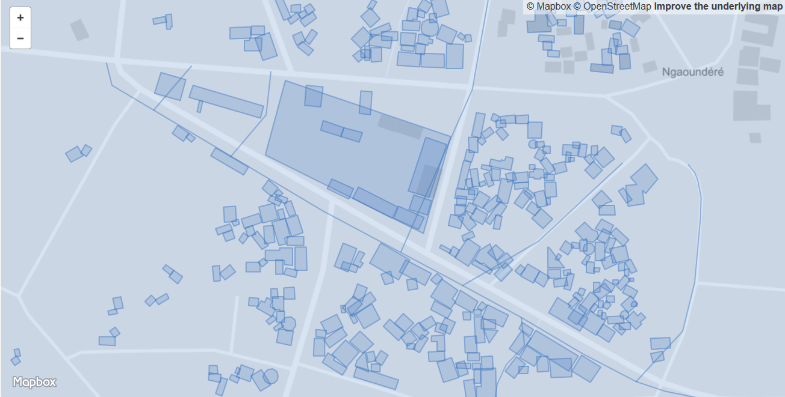
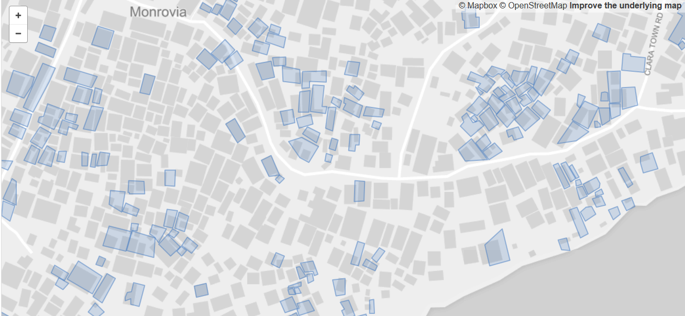
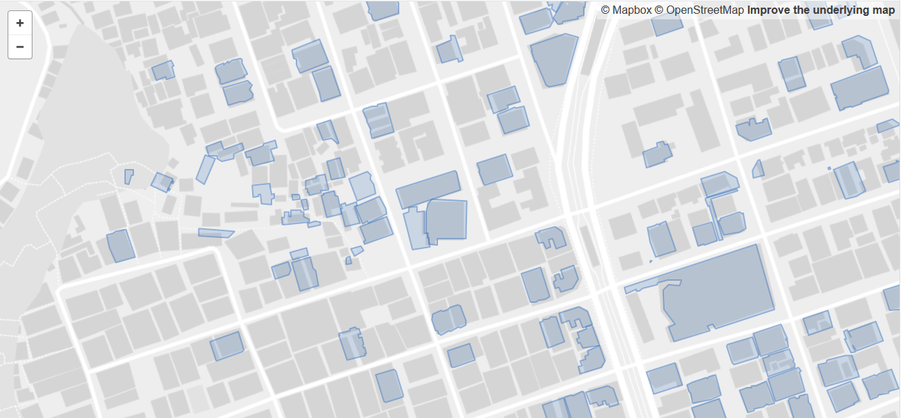
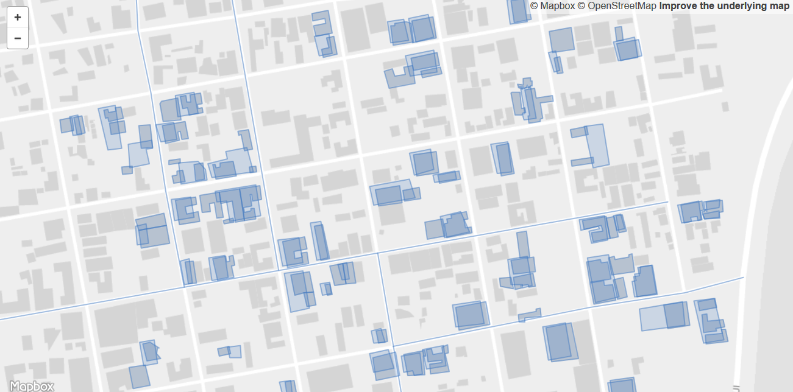
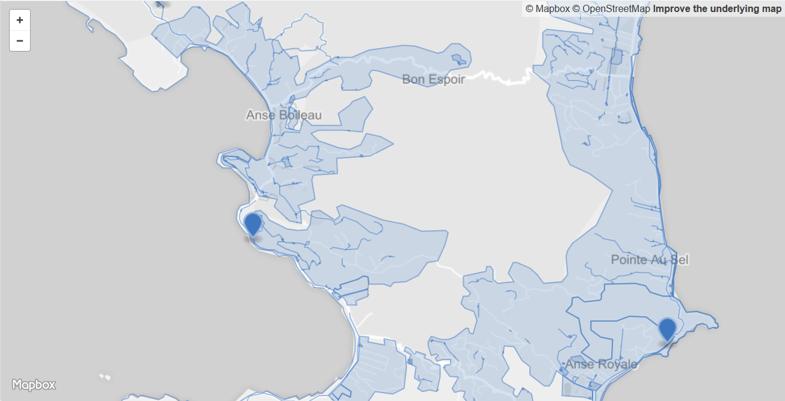

# 2018-08-27 OSM Database Quality Analysis : Building overlaps and irregular geometries - Various cartographic projects comparison
In a [first article](Bulding_Geometry_Analysis_to_Support_OpenStreetMap_Quality_Analysis.md) on august 8 in this Blog, we presented our classification of Building forms in the OSM Database. For example, we examined the buildings data added for the Ebola response in North Kivu, DRC, and measured the proportion of buildings of irregular shape. 

These buildings are generally in small number and a high proportion of buildings with irregular shape in the OSM database for an area is an indication to take a closer look at the data and validate the quality of the drawing of building contours.  In dense urban environments, there is a great challenge in accurately tracing building contours and walkways between buildings. The situation is also becoming more complicated when the aerial imageries available to trace in OSM are dark or blurred or if different images are not perfectly aligned.  Mapathons where a large number of beginners participate are also likely to cause OSM data quality problems.

*Figure 1 Invalid Polygons / Osmosis Quality Tool*

In many projects, the OSM Tasking Manager role is used to distribute the task to a great number of simultaneous contributors and to avoid collisions and edit conflicts. This assures the coordinators of a mapping project to cover systematically the territory for both the mapping and data validation stages. The various Quality tools also make it possible to identify problems in the area and correct them. However, we often find that after a mapathon, the data can remain unchanged for years because there are not enough contributors to go through the area and correct the data.  Also, there are some coordination aspects that are not covered by the Tasking manager tools. The dahsboared is quite limited with a simple indication that a square is completed and validated. No evaluation about the data if any is added.  We have to count on the validators. But either unexperienced contributors validate or experienced contributors are more and more demotivated when not seeing improvement in the quality of the data.

*Figure 2 Invalid Polygons Detection* 

We propose to use the topological analysis on data extracted for the zone to both monitor data quality and flagged objects for revision. Data quality tools such as Osmose already provide a lot of such information, but we need some flexibility to obtain quickly the data for the zone and assaure a better monitoring.  The access to these tools via API could eventually let extract such data for a geographic zone.

In our project, the statistics produced on the objects flagged for further examination make it possible to measure the extent of the phenomenon and make comparizons with cartographic projects in similar zones. This tool also provides a file containing buildings and other objects to validate/correct using editors such as JOSM. In this case, the ToDO plugin allows to revise one by one the objects contained in the file, validate and correct if necessary. The identification of buildings of irregular shape was a a first measure. Polygons of invalid buildings (see Figure 1) were also identified. 

In this second article on topological analysis, superimposed objects (ie. buildings, roads, streams, land use polygons, etc) are added to the list of objects flagged for more analysis.

During the Open Cities Africa Conference in Dar Es Salaam this week, the participating cities will discuss the quality of the data. 
This is important to ensure the credibility of volunteered cartographic projects and to provide useful data for different projects that 
require geographic data.   The following comparison of mapping projects from different participating cities and 
the proposed analytical approach will hopefully contribute to this discussion. 

# Quality Analysis - Buildings and other Objects Overlaps
Buildings, roads and other objects drawn with imprecision or errors during editing moving a point will often have the effect to overlap polygons (buildings, land use, water contours, territorial boundaries, etc.) and lines such as roads and railways.  Figure 3 illustrates these overlays, showing buildings and roads that overlap. Various projects in recent years, often in the context of natural crises or disasters, have partially mapped the cities on this list. Despite validations, many errors have not yet been corrected. The Quality tools list these errors but it is difficult to have an overview and to measure the importance of these flagged objects for Quality analysis.

*Figure3 Overlapped Buildings and Roads*

Our topological analysis tool let's identify every building, road, waterway or other object overlapping. A statistic of flagged objects is computed and a ID list of flagged objects is also available. An Overpass query using this ID list (see figure 4) 
let's produce OSM data files containing the objects concerned. This then allows the file to be imported into JOSM for analysis and correction.  The map visualisation from the GeoJSON files presented below for each city, let's have an overview of objects flagged for analysis. It is also possible to zoom in for more detail.

*Figure 4 Overpass Query - Flagged Id's - Quality Analysis*

# «State of the Map» Comparison, Various towns, project Open Cities Africa
For comparison purposes, we selected cities from the Open Cities Africa project for which OSM tasking manager projects were available. Otherwise we selected a rectangular zone to represent the city.  The selected areas may cover a larger area than the Open Cities project but nevertheless represents a good indication of the state of the map, the quality of the OSM data in the area.  Each city has its own cartographic history, with rapid response to a disaster or variable quality of imagery, organization of mapathons with beginners, etc. Building architecture from one city to another can also vary and in some cities a higher number of buildings with irregular shapes can really exist.  

For example, during the Ebola outbreak in Monrovia in 2014, the city had to be mapped quickly to help humanitarian teams, despite the poor quality of the imagery available. As the images are still lacking in precision, recent projects have not succeeded in significantly improving quality.   In Ngaoundere, following a recent mapping project, many duplicates and superimposed buildings have been added. 
Topological analysis tools enable to detect quickly quality problems and made the necessary corrections.

Table 1 presents a comparison of the results obtained with the topological analysis. The sections below for each town / city provide links to vector maps for each class of buildings flagged for evaluation.
The flagged buildings are grouped according to
- Buildings - Irregular geometry and invalid polygons
- Overlapped buildings (with other buildings or other objects)

On average, a rate of 25.9% of buildings are flagged with irregular geometry and 5.7% with Overlaps, this in proportion of total buildings for the zone. In total, flagged objects (objects to be validated)  represent 31.7% of buildings. Rather than the average, we should focus on the discrepancy of rates between the various cities analyzed.  How to explain these differences ranging from 3.6? with Kisenso to 74.8% for Victoria?  Topological errors (Overlays + Invalid polygons do not represent the largest share of alerts. On the other hand, one must question the high rate of buildings with irregular shapes in certain zones.  Can irregular shapes vary so much from one place to the other? Can differences be explained by different architectures in informal urban areas?  And for some cities, various remotely organized mapathons may have significantly increased the level of flagged objects.

These maps represent the current situation for each city (ie The State of the Map). The lack of quality in some places represents an additional challenge and it will surely be necessary to think about how to improve the OSM database for the area while assuring to make progress with the project.

*Table 1 : Topological Analysis Comparison, Flagged objects in % of buildings for the zone, 6 Open Cities Africa projects*

|	Town	|	Buildings	|	Warning Irreg. Form	|	%	|	Error Overlaps +Invalid Polyg	|	%	|	Total Flags % |
|	:------------------------------------------	|	--------:	|	------:	|	--------:	|	------:	|	------:	|	------:	|
|	Kisenso 2018-08-16	|	20089	|	324	|	1.6%	|	391	|	1.9%	|	3.6%	|
|	Kampala 2018-04-07	|	11327	|	1001	|	8.8%	|	343	|	3.0%	|	11.9%	|
|	Ngaoundere 2018-08-06	|	73609	|	9998	|	13.6%	|	4439	|	6.0%	|	19.6%	|
|	Monrovia 2018-08-25	|	4107	|	751	|	18.3%	|	441	|	10.7%	|	29.0%	|
|	Accra 2018-08-25	|	7699	|	1396	|	18.1%	|	13	|	0.2%	|	18.3%	|
|	Dar Es Sallaam 2018-08-25	|	2579	|	334	|	13.0%	|	80	|	3.1%	|	16.1%	|
|	Saint-Louis 2018-08-27	|	25970	|	6548	|	25.2%	|	3814	|	14.7%	|	39.9%	|
|	Victoria 2018-08-27	|	37299	|	27015	|	72.4%	|	898	|	2.4%	|	74.8%	|
|	Total projects analysed|	182679	|	47367	|	25.9%	|	10419	|	5.7%	|	31.6%	|

For each town / city, we find the hyperlinks to the vector maps of the objects flagged for evaluation. We also find an image illustrating this geographical area.  The title indicates to which date the vector data correspond for a town / city.  When we visualize the GeoJSON map, the vector data appears in blue. The background map represents the current OSM data. For example, if a route has been modified in the OSM database since extraction for analysis to correct overlaps of roads and buildings, you will notice a difference in alignment between the vector map data om blue and the background map.

## Kisenso. 2018-08-16
* [Kisenso, Irregular Building Forms](https://github.com/opendatalabrdc/Documentation/blob/master/topology/topology-irregular-forms-kisenso-2018-08-16.geojson)
* [Kisenso, Overlapped objects](https://github.com/opendatalabrdc/Documentation/blob/master/topology/topology-overlap-kisenso-2018-08-16.geojson)

## Kampala, 2018-04-07, Task 4360, hotosm

* [Kampala, Irregular Building Forms](https://github.com/opendatalabrdc/Documentation/blob/master/topology/topology-irregular-forms-OC_Kampala_hotosm_4360_2018_04_07.geojson) 
* [Kampala, Overlapped objects](https://github.com/opendatalabrdc/Documentation/blob/master/topology/topology-overlap-OC_Kampala_hotosm_4360_2018_04_07.geojson)

## Ngaoundere, 2018-08-06, Task 4800, hotosm
* [Ngaoundere, Irregular Building Forms](https://github.com/opendatalabrdc/Documentation/blob/master/topology/topology-irregular-forms-OC_Ngaoundere_hotosm_4800_2018_08_06.geojson) 
* [Ngaoundere, Overlapped objects](https://github.com/opendatalabrdc/Documentation/blob/master/topology/topology-overlap-OC_Ngaoundere_hotosm_4800_2018_08_06.geojson)

## Monrovia, 2018-08-25, Task 4366, hotosm
* [Monrovia, Irregular Building Forms](https://github.com/opendatalabrdc/Documentation/blob/master/topology/topology-irregular-forms-OC_monrovia_hotosm_4866_2018_08_25.geojson) 
* [Monrovia, Overlapped objects](https://github.com/opendatalabrdc/Documentation/blob/master/topology/topology-overlap-oc_monrovia_hotosm_4866_2018_08_25.geojson)

## Accra, 2018-08-25, Task 4969, hotosm
* [Accra, Irregular Building Forms](https://github.com/opendatalabrdc/Documentation/blob/master/topology/topology-irregular-forms-OC_Accra_hotosm_4969_2018_08_25.geojson)
* [Accra, Overlapped objects](https://github.com/opendatalabrdc/Documentation/blob/master/topology/topology-overlap-OC_Accra_hotosm_4969_2018_08_25.geojson)

## Dar Es Salaam, 2018-08-25, Task 5012, hotosm
* [Dar Es Salaam, Irregular Building Forms](https://github.com/opendatalabrdc/Documentation/blob/master/topology/topology-irregular-forms-OC_DarEsSalaam_hotosm_5012.geojson)
* [Dar Es Salaam, Overlapped objects](https://github.com/opendatalabrdc/Documentation/blob/master/topology/topology-overlap-OC_DarEsSalaam_hotosm_5012.geojson)

## Saint-Louis, 2018-08-27
* [Saint-Louis, Irregular building Forms](https://github.com/opendatalabrdc/Documentation/blob/master/topology/topology-irregular-forms-oc_saint_louis_2018_08_27.geojson)
* [Saint-Louis, , Overlapped objects](https://github.com/opendatalabrdc/Documentation/blob/master/topology/topology-overlap-oc_saint_louis_2018_08_27.geojson)

## Victoria, 2018-08-27

* [Victoria, Irregular building Forms](https://github.com/opendatalabrdc/Documentation/blob/master/topology/topology-irregular-form-oc_victoria_2018_08_27.geojson.zip)
* [Victoria, Overlapped objects](https://github.com/opendatalabrdc/Documentation/blob/master/topology/topology-overlap-oc_victoria_2018_08_27.geojson)

  

*Pierre Béland*
